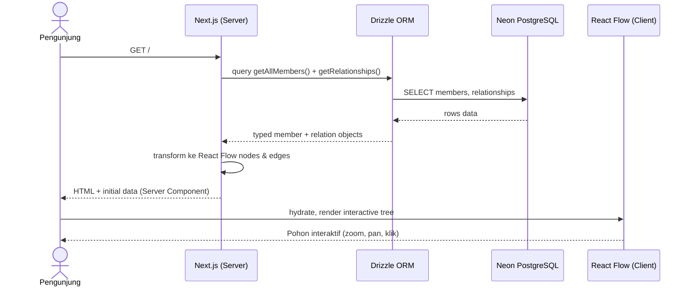
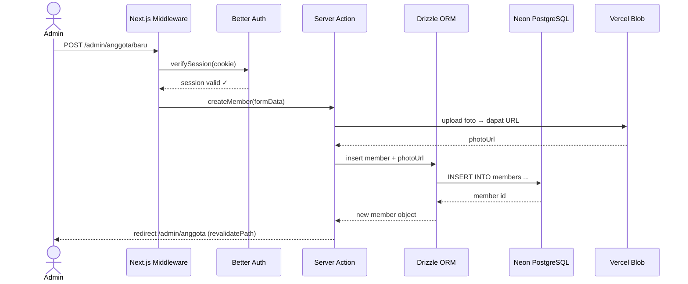
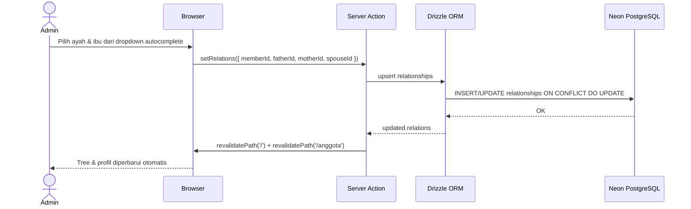
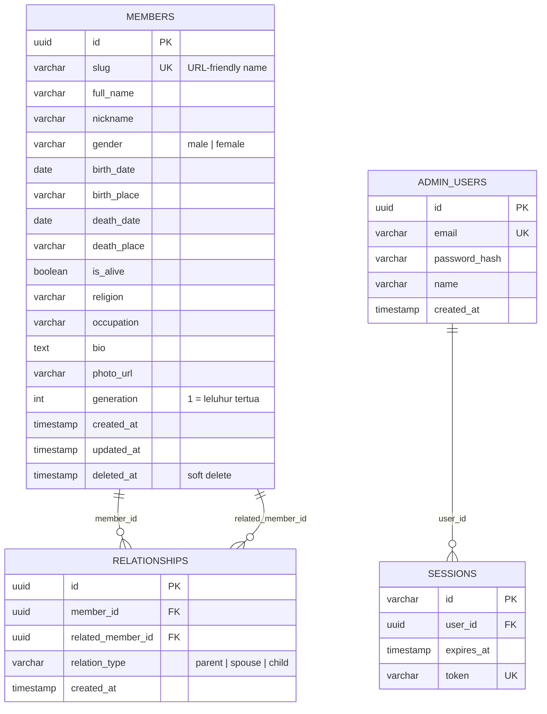

# PRD — Website Silsilah Keluarga
**Versi:** 1.0 — MVP  
**Tanggal:** April 2026  
**Author:** Solo Developer  
**Stack:** Next.js 14 (App Router) · Drizzle ORM · Better Auth · Neon PostgreSQL · Shadcn UI · Vercel

---

## 1. Overview

### Latar Belakang
Keluarga besar (50–200 orang) kehilangan koneksi antar generasi karena tidak ada satu sumber kebenaran yang mudah diakses untuk melihat silsilah, riwayat hidup, dan hubungan antar anggota keluarga.

### Visi Produk
Website silsilah keluarga yang bisa **dilihat siapa saja tanpa login** — interaktif, visual, dan informatif — serta dikelola sepenuhnya oleh **satu admin** yang berwenang.

### Target Pengguna
| Persona | Akses | Kebutuhan Utama |
|--------|-------|-----------------|
| **Anggota keluarga** (publik) | View only, tanpa login | Lihat pohon keluarga, cari nama, baca profil |
| **Admin** (kepala keluarga/pengelola) | Full CRUD setelah login | Tambah/edit/hapus anggota, atur relasi di pohon |

### Success Metrics (MVP)
- Seluruh anggota keluarga bisa mengakses pohon dalam < 3 klik dari URL
- Admin bisa menambah anggota baru + mengatur posisinya dalam < 5 menit
- Pohon mampu merender 200 node tanpa lag signifikan

---

## 2. Requirements

### Functional Requirements

**Publik (tanpa login):**
- [ ] Melihat pohon silsilah secara interaktif (zoom, pan, klik node)
- [ ] Melihat halaman profil detail tiap anggota keluarga
- [ ] Mencari anggota keluarga berdasarkan nama
- [ ] Melihat daftar anggota keluarga

**Admin (setelah login):**
- [ ] Login / logout menggunakan Better Auth
- [ ] Tambah anggota keluarga baru (data + foto)
- [ ] Edit data anggota keluarga
- [ ] Hapus anggota keluarga (soft delete)
- [ ] Atur relasi: tentukan ayah, ibu, pasangan dari tiap anggota
- [ ] Upload foto profil anggota

### Non-Functional Requirements
- **Performance:** First Contentful Paint < 2 detik (Vercel Edge)
- **Scalability:** Mendukung hingga 500 node tanpa refactor arsitektur
- **Accessibility:** Kontras warna WCAG AA, navigasi keyboard pada tree
- **Mobile:** Responsive, tree bisa di-pan & zoom di layar sentuh
- **Security:** Endpoint admin diproteksi middleware Better Auth; tidak ada data sensitif yang exposed ke publik

---

## 3. Core Features (MVP)

### Feature 1 — Interactive Family Tree Viewer
**Prioritas:** P0 — Fitur utama

- Library: **React Flow** (node-based graph, highly customizable)
- Setiap node menampilkan: foto thumbnail, nama lengkap, tahun lahir–wafat
- Klik node → slide-over panel atau navigate ke halaman profil
- Kontrol: zoom in/out, fit to screen, search & highlight node
- Layout: top-down generational tree (generasi tertua di atas)
- Koneksi visual dibedakan: garis vertikal (orang tua–anak), garis horizontal putus-putus (pasangan)

### Feature 2 — Member Profile Page
**Prioritas:** P0

Route: `/anggota/[slug]`

Data yang ditampilkan:
- Foto profil (full size)
- Nama lengkap, nama panggilan
- Tanggal & tempat lahir / wafat
- Jenis kelamin
- Agama
- Pekerjaan / profesi
- Biografi singkat (rich text)
- Relasi: orang tua, pasangan, anak-anak (dengan link ke profil masing-masing)
- Generasi ke-N dari leluhur pertama

### Feature 3 — Search & Directory
**Prioritas:** P1

- Search bar global (nama, tempat lahir)
- Halaman `/anggota` — daftar semua anggota dengan filter generasi & status (hidup/wafat)
- Hasil search highlight node di pohon

### Feature 4 — Admin Panel (CRUD)
**Prioritas:** P0

Route: `/admin/*` — diproteksi middleware

Sub-fitur:
- **`/admin/anggota`** — Tabel daftar anggota + tombol tambah/edit/hapus
- **`/admin/anggota/baru`** — Form tambah anggota (field lengkap + upload foto)
- **`/admin/anggota/[id]/edit`** — Form edit anggota
- **`/admin/anggota/[id]/relasi`** — Atur relasi (pilih ayah, ibu, pasangan dari dropdown autocomplete)
- **`/admin/login`** — Halaman login Better Auth

### Feature 5 — Admin Auth
**Prioritas:** P0

- Better Auth dengan credential provider (email + password)
- Single admin account — seeded via database seed script
- Session management via Better Auth (cookie-based)
- Middleware Next.js protect semua route `/admin/*`

---

## 4. User Flow

### Flow A — Anggota Keluarga Melihat Pohon

```
Landing Page (/)
    │
    ├── Lihat pohon interaktif langsung (default: fit-to-screen)
    │       │
    │       ├── Klik node anggota
    │       │       └── Halaman profil /anggota/[slug]
    │       │               └── Klik relasi (orang tua/anak/pasangan)
    │       │                       └── Profil anggota lain
    │       │
    │       └── Gunakan search bar
    │               └── Highlight node di pohon + link ke profil
    │
    └── Navigasi ke /anggota (direktori lengkap)
            └── Klik nama → /anggota/[slug]
```

### Flow B — Admin Mengelola Data

```
/admin/login
    │
    └── Login berhasil → /admin/dashboard
            │
            ├── Tambah anggota baru
            │       └── /admin/anggota/baru (isi form + upload foto)
            │               └── Submit → tersimpan → redirect ke /admin/anggota
            │
            ├── Edit anggota
            │       └── /admin/anggota/[id]/edit
            │               └── Ubah data → Submit → tersimpan
            │
            ├── Atur relasi
            │       └── /admin/anggota/[id]/relasi
            │               └── Pilih ayah, ibu, pasangan (autocomplete)
            │                       └── Simpan → tree diperbarui
            │
            └── Hapus anggota (soft delete, konfirmasi dialog)
```

---

## 5. Architecture

### Stack Decision

| Layer | Teknologi | Alasan |
|-------|-----------|--------|
| Frontend | Next.js 14 App Router | SSR untuk SEO profil, client component untuk tree |
| Tree Viz | React Flow | Open source, customizable, performa baik untuk 200+ node |
| Auth | Better Auth | Ringan, native Next.js, credential provider |
| ORM | Drizzle ORM | Type-safe, ringan, cocok dengan Neon |
| Database | Neon PostgreSQL | Serverless PostgreSQL, free tier cukup untuk skala ini |
| Storage | Vercel Blob / Cloudinary | Upload foto profil anggota |
| UI | Shadcn UI + Tailwind | Konsisten, aksesibel, customizable |
| Deployment | Vercel | Zero-config, edge functions |

### Diagram Arsitektur Sequence

**Flow: Publik melihat pohon keluarga**



**Flow: Admin menambah anggota baru**



**Flow: Admin mengatur relasi anggota**



---

## 6. Database Schema

### ER Diagram



### Ringkasan Tabel

#### `members`
Menyimpan semua data personal anggota keluarga.
- `slug`: digunakan sebagai URL `/anggota/budi-santoso-1955` — digenerate otomatis dari nama + tahun lahir
- `generation`: integer, dihitung manual oleh admin. Generasi 1 = leluhur tertama (kakek buyut, dst)
- `deleted_at`: soft delete — data tidak hilang dari DB, hanya tidak ditampilkan

#### `relationships`
Tabel pivot yang menyimpan relasi antar anggota menggunakan pattern adjacency list.
- `relation_type`:
  - `parent` → `member_id` adalah anak dari `related_member_id`
  - `spouse` → `member_id` berpasangan dengan `related_member_id` (bidirectional)
  - `child` → inverse dari parent (opsional, bisa diderive)
- Untuk menentukan "siapa orang tua dari X": `SELECT * FROM relationships WHERE member_id = X AND relation_type = 'parent'`

#### `admin_users`
Single row di MVP — diseed via script. Email + password hash (bcrypt via Better Auth).

#### `sessions`
Dikelola penuh oleh Better Auth. Tidak perlu disentuh manual.

### Drizzle Schema (Referensi)

```typescript
// db/schema.ts
import { pgTable, uuid, varchar, date, boolean, text, timestamp, integer } from 'drizzle-orm/pg-core'

export const members = pgTable('members', {
  id: uuid('id').primaryKey().defaultRandom(),
  slug: varchar('slug', { length: 255 }).unique().notNull(),
  fullName: varchar('full_name', { length: 255 }).notNull(),
  nickname: varchar('nickname', { length: 100 }),
  gender: varchar('gender', { length: 10 }).notNull(), // 'male' | 'female'
  birthDate: date('birth_date'),
  birthPlace: varchar('birth_place', { length: 255 }),
  deathDate: date('death_date'),
  deathPlace: varchar('death_place', { length: 255 }),
  isAlive: boolean('is_alive').default(true),
  religion: varchar('religion', { length: 100 }),
  occupation: varchar('occupation', { length: 255 }),
  bio: text('bio'),
  photoUrl: varchar('photo_url', { length: 500 }),
  generation: integer('generation').default(1),
  createdAt: timestamp('created_at').defaultNow(),
  updatedAt: timestamp('updated_at').defaultNow(),
  deletedAt: timestamp('deleted_at'), // soft delete
})

export const relationships = pgTable('relationships', {
  id: uuid('id').primaryKey().defaultRandom(),
  memberId: uuid('member_id').references(() => members.id),
  relatedMemberId: uuid('related_member_id').references(() => members.id),
  relationType: varchar('relation_type', { length: 20 }).notNull(), // 'parent' | 'spouse'
  createdAt: timestamp('created_at').defaultNow(),
})
```

---

## 7. Design & Technical Constraints

### Design Constraints

**Visual Language:**
- Tone: **Hangat, elegan, organik** — bukan corporate/tech. Bayangkan buku keluarga heritage.
- Primary color: Coklat hangat / emas (`#8B5E3C`, `#C4963F`) dengan background krem (`#FAF7F2`)
- Typography: Display font serif (misal: **Playfair Display**) untuk nama; body font humanist sans (misal: **Lato** atau **Source Sans 3**)
- Node pada React Flow: kartu oval/rounded dengan foto, nama, tahun — bukan box generik
- Koneksi: garis organik/curved, bukan garis lurus kaku

**Responsive:**
- Desktop: Tree full-screen dengan sidebar info
- Mobile: Tree bisa di-pinch zoom; profil tampil sebagai halaman penuh terpisah

### Technical Constraints

**React Flow — Performa:**
- Untuk 200 node, gunakan `useNodesState` + `useEdgesState` dengan data dicompute di server
- Hindari re-render tree saat tidak perlu — memoize nodes & edges dengan `useMemo`
- Aktifkan `nodesDraggable={false}` di public view untuk performa lebih baik
- Pertimbangkan virtualisasi jika tree tumbuh > 300 node (React Flow Pro punya fitur ini)

**Tree Layout Algorithm:**
- Gunakan library **`dagre`** (atau `elkjs`) untuk auto-layout top-down tree
- Jangan layout manual — terlalu brittle untuk data dinamis
- Install: `npm install dagre @dagrejs/dagre`

**Slug Generation:**
```typescript
// lib/slug.ts
function generateSlug(fullName: string, birthYear?: number): string {
  const base = fullName.toLowerCase()
    .replace(/[^a-z0-9\s]/g, '')
    .replace(/\s+/g, '-')
  return birthYear ? `${base}-${birthYear}` : base
}
```

**Server Actions Pattern (Admin CRUD):**
- Semua mutasi via Next.js Server Actions — tidak perlu API routes terpisah
- Validasi input menggunakan **Zod** sebelum insert ke DB
- Selalu `revalidatePath('/')` dan `revalidatePath('/anggota')` setelah mutasi

**Image Upload:**
- Gunakan **Vercel Blob** (`@vercel/blob`) — terintegrasi zero-config dengan Vercel
- Resize gambar di client sebelum upload (gunakan `browser-image-compression`) — target max 800px, < 200KB
- Simpan URL Blob di kolom `photo_url` di tabel `members`

**Better Auth Setup:**
```typescript
// auth.ts
import { betterAuth } from 'better-auth'
import { drizzleAdapter } from 'better-auth/adapters/drizzle'

export const auth = betterAuth({
  database: drizzleAdapter(db, { provider: 'pg' }),
  emailAndPassword: { enabled: true },
})
```

**Middleware Protection:**
```typescript
// middleware.ts
import { NextRequest, NextResponse } from 'next/server'
import { getSessionFromRequest } from './auth'

export async function middleware(req: NextRequest) {
  if (req.nextUrl.pathname.startsWith('/admin')) {
    const session = await getSessionFromRequest(req)
    if (!session && !req.nextUrl.pathname.includes('/login')) {
      return NextResponse.redirect(new URL('/admin/login', req.url))
    }
  }
  return NextResponse.next()
}
```

---

## Roadmap Pengembangan

### Phase 1 — MVP (4–6 minggu solo dev)
- [x] Setup project: Next.js + Drizzle + Neon + Better Auth + Shadcn
- [ ] Database schema + seed admin user
- [ ] Admin CRUD: tambah/edit/hapus anggota
- [ ] Admin: atur relasi (parent, spouse)
- [ ] Public: halaman pohon dengan React Flow + dagre layout
- [ ] Public: halaman profil anggota
- [ ] Deploy ke Vercel

### Phase 2 — Enhancement (Post-MVP)
- [ ] Search global (nama, tempat lahir) dengan highlight di tree
- [ ] Halaman direktori `/anggota` dengan filter generasi
- [ ] Export pohon sebagai gambar (PNG/PDF)
- [ ] Statistik keluarga (total anggota, persebaran domisili)
- [ ] Mode "jalur ke leluhur" — highlight path dari anggota ke root

### Phase 3 — Future
- [ ] Multi-admin dengan role editor (submit, admin yang approve)
- [ ] Import data dari GEDCOM (format standar silsilah)
- [ ] Galeri foto keluarga per acara / milestone
- [ ] Notifikasi ulang tahun via WhatsApp/Email
